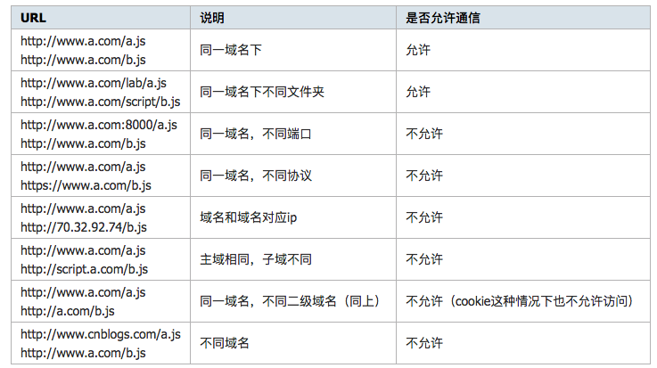
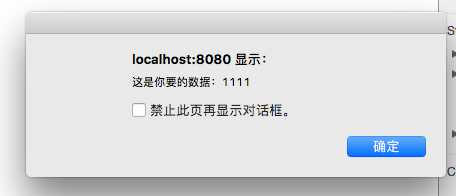
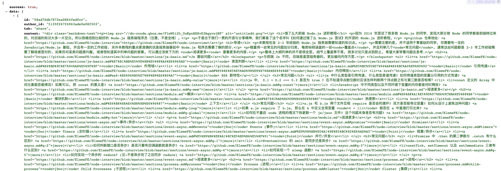
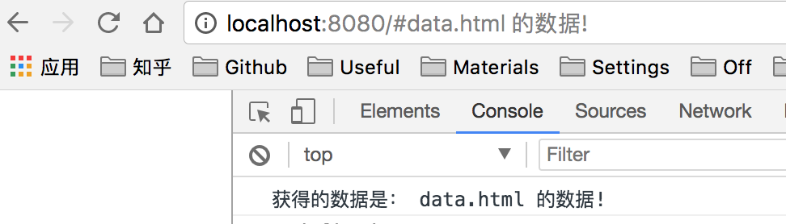
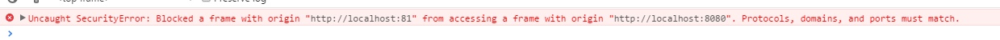
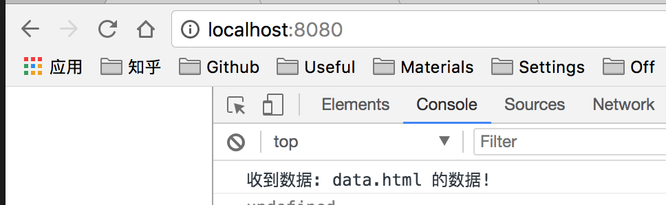
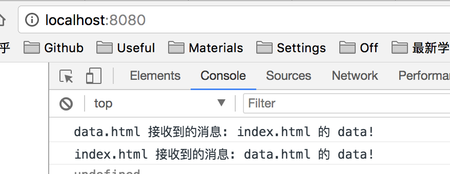
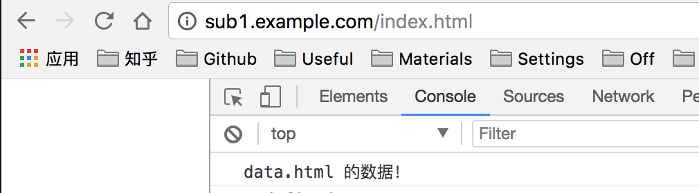

[原文地址](https://github.com/happylindz/blog/issues/3)

# 跨域，你需要知道的全在这里

这篇文章是之前写的，我重新整理了下，阅读本文前，希望你有一定的 JS/Node 基础，这里不另外介绍如何使用 Ajax 做异步请求，如果不了解，可以先看：

[Ajax知识体系大梳理](http://louiszhai.github.io/2016/11/02/ajax/)

最近在面试的时候常被问到如何解决跨域的问题，看了网上的一些文章后，许多文章并没有介绍清楚，经常使读者(我)感到困惑，所以今天我整理一下常用的跨域技巧，写这篇关于跨域的文章目的在于：

1. 介绍常见的跨域的解决方案以及其优缺点
2. 模拟实际的跨域场景，在每种方案后给出一个简单的实例，能够让读者和我一起敲代码，直观地理解这些跨域技巧

如果觉得本文有帮助，可以点 star 鼓励下，本文所有代码都可以从 github 仓库下载，读者可以按照下述打开:

```bash
git clone https://github.com/happylindz/blog.git
cd blog/code/crossOrigin/
yarn 
```
建议你 clone 下来，方便你阅读代码，跟我一起测试。

## 同源策略

使用过 Ajax 的同学都知道其便利性，可以在不向服务端提交完整页面的情况下，实现局部刷新，在当今 SPA 应用普遍使用，但是浏览器处于对安全方面的考虑，不允许跨域调用其它页面的对象，这对于我们在注入 iframe 或是 ajax 应用上带来不少麻烦。

简单来说，只有当协议，域名，端口号相同的时候才算是同一个域名，否则，均认为需要做跨域处理。



## 跨域方法

今天一共介绍七种常用的跨域技巧，关于跨域技巧大致可以分为 iframe 跨域和 API 跨域请求。

下面就先介绍三种 API 跨域的方法:

## 1. JSONP：

只要说到跨域，就必须聊到 JSONP，JSONP 全称为：JSON with padding，可用于解决老版本浏览器的跨域数据访问问题。

由于 web 页面上调用 js 文件不受浏览器同源策略的影响，所以通过 script 标签可以进行跨域请求：

1. 首先前端需要先设置好回调函数，并将其作为 url 的参数。
2. 服务端接收到请求后，通过该参数获取到回调函数名，并将数据放在参数中将其返回
3. 收到结果后因为是 script 标签，所以浏览器会当做是脚本进行运行，从而达到跨域获取数据的目的

jsonp 之所以能够跨域的关键在于页面调用 JS 脚本是不受同源策略的影响，相当于向后端发起一条 http 请求，跟后端约定好函数名，后端拿到函数名，动态计算出返回结果并返回给前端执行 JS 脚本，相当于是一种 "动态 JS 脚本"

接下来我们通过一个实例来尝试：

后端逻辑：

```javascript
// jsonp/server.js
const url = require('url');
	
require('http').createServer((req, res) => {
	const data = {
		x: 10
	};
	// 拿到回调函数名
	const callback = url.parse(req.url, true).query.callback;
	console.log(callback);
	res.writeHead(200);
	res.end(`${callback}(${JSON.stringify(data)})`);

}).listen(3000, '127.0.0.1');

console.log('启动服务，监听 127.0.0.1:3000');
```

前端逻辑：

```html
// jsonp/index.html
<script>
    function jsonpCallback(data) {
        alert('获得 X 数据:' + data.x);
    }
</script>
<script src="http://127.0.0.1:3000?callback=jsonpCallback"></script>
```
然后在终端开启服务：

之所以能用脚本指令，是因为我在 package.json 里面设置好了脚本命令：

```json
{
  // 输入 yarn jsonp 等于 "node ./jsonp/server.js & http-server ./jsonp"
  "scripts": {
    "jsonp": "node ./jsonp/server.js & http-server ./jsonp",
    "cors": "node ./cors/server.js & http-server ./cors",
    "proxy": "node ./serverProxy/server.js",
    "hash": "http-server ./hash/client/ -p 8080 & http-server ./hash/server/ -p 8081",
    "name": "http-server ./name/client/ -p 8080 & http-server ./name/server/ -p 8081",
    "postMessage": "http-server ./postMessage/client/ -p 8080 & http-server ./postMessage/server/ -p 8081",
    "domain": "http-server ./domain/client/ -p 8080 & http-server ./domain/server/ -p 8081"
  },
  // ...
}
```

```bash 
yarn jsonp
// 因为端口 3000 和 8080 分别属于不同域名下
// 在 localhost:3000 查看效果，即可收到后台返回的数据 10
```

打开浏览器访问 ```localhost:8080``` 即可看到获取到的数据。


至此，通过 JSONP 跨域获取数据已经成功了，但是通过这种方式也存在着一定的优缺点：

优点：

1. 它不像XMLHttpRequest 对象实现 Ajax 请求那样受到同源策略的限制
2. 兼容性很好，在古老的浏览器也能很好的运行
3. 不需要 XMLHttpRequest 或 ActiveX 的支持；并且在请求完毕后可以通过调用 callback 的方式回传结果。

缺点：

1. 它支持 GET 请求而不支持 POST 等其它类行的 HTTP 请求。
2. 它只支持跨域 HTTP 请求这种情况，不能解决不同域的两个页面或 iframe 之间进行数据通信的问题
3. 无法捕获 Jsonp 请求时的连接异常，只能通过超时进行处理

## CORS:

CORS 是一个 W3C 标准，全称是"跨域资源共享"（Cross-origin resource sharing）它允许浏览器向跨源服务器，发出 XMLHttpRequest 请求，从而克服了 ajax 只能同源使用的限制。

CORS 需要浏览器和服务器同时支持才可以生效，对于开发者来说，CORS 通信与同源的 ajax 通信没有差别，代码完全一样。浏览器一旦发现 ajax 请求跨源，就会自动添加一些附加的头信息，有时还会多出一次附加的请求，但用户不会有感觉。

因此，实现 CORS 通信的关键是服务器。只要服务器实现了 CORS 接口，就可以跨域通信。

前端逻辑很简单，只要正常发起 ajax 请求即可:

```javascript
// cors/index.html
<script>
	const xhr = new XMLHttpRequest();
	xhr.open('GET', 'http://127.0.0.1:3000', true);
	xhr.onreadystatechange = function() {
		if(xhr.readyState === 4 && xhr.status === 200) {
			alert(xhr.responseText);
		}
	}
	xhr.send(null);
</script>
```

这似乎跟一次正常的异步 ajax 请求没有什么区别，关键是在服务端收到请求后的处理：

```javascript
// cors/server.js
require('http').createServer((req, res) => {

	res.writeHead(200, {
		'Access-Control-Allow-Origin': 'http://localhost:8080',
		'Content-Type': 'text/html;charset=utf-8',
	});
	res.end('这是你要的数据：1111');

}).listen(3000, '127.0.0.1');

console.log('启动服务，监听 127.0.0.1:3000');
```

关键是在于设置相应头中的 Access-Control-Allow-Origin，该值要与请求头中 Origin 一致才能生效，否则将跨域失败。

然后我们执行命令：```yarn cors``` 打开浏览器访问 ```localhost:3000``` 即可看到效果：



成功的关键在于 Access-Control-Allow-Origin 是否包含请求页面的域名，如果不包含的话，浏览器将认为这是一次失败的异步请求，将会调用 xhr.onerror 中的函数。

CORS 的优缺点：

1. 使用简单方便，更为安全
2. 支持 POST 请求方式
3. CORS 是一种新型的跨域问题的解决方案，存在兼容问题，仅支持 IE 10 以上

这里只是对 CORS 做一个简单的介绍，如果想更详细地了解其原理的话，可以看看下面这篇文章：

[跨域资源共享 CORS 详解 - 阮一峰的网络日志](http://www.ruanyifeng.com/blog/2016/04/cors.html)


## 3. 服务端代理：

服务器代理，顾名思义，当你需要有跨域的请求操作时发送请求给后端，让后端帮你代为请求，然后最后将获取的结果发送给你。

假设有这样的一个场景，你的页面需要获取 [CNode：Node.js专业中文社区](https://cnodejs.org/api) 论坛上一些数据，如通过 ```https://cnodejs.org/api/v1/topics```，当时因为不同域，所以你可以将请求后端，让其对该请求代为转发。

代码如下：

```
// serverProxy/server.js
const url = require('url');
const http = require('http');
const https = require('https');

const server = http.createServer((req, res) => {
	const path = url.parse(req.url).path.slice(1);
	if(path === 'topics') {
		https.get('https://cnodejs.org/api/v1/topics', (resp) => {
			let data = "";
			resp.on('data', chunk => {
				data += chunk;
			});
			resp.on('end', () => {
				res.writeHead(200, {
					'Content-Type': 'application/json; charset=utf-8'
				});
				res.end(data);
			});
		})		
	}
}).listen(3000, '127.0.0.1');
console.log('启动服务，监听 127.0.0.1:3000');
```

通过代码你可以看出，当你访问 ```http://127.0.0.1:3000/topics``` 的时候，服务器收到请求，会代你发送请求 ```https://cnodejs.org/api/v1/topics``` 最后将获取到的数据发送给浏览器。

启动服务 ```yarn proxy``` 并访问 ```http://localhost:3000/topics``` 即可看到效果：



跨域请求成功。纯粹的获取跨域获取后端数据的请求的方式已经介绍完了，另外介绍四种通过 iframe 跨域与其它页面通信的方式。

## location.hash：

在 url 中，```http://www.baidu.com#helloworld``` 的 "#helloworld" 就是 location.hash，改变 hash 值不会导致页面刷新，所以可以利用 hash 值来进行数据的传递，当然数据量是有限的。

假设 ```localhost:8080``` 下有文件 index.html 要和 ```localhost:8081``` 下的 data.html 传递消息，index.html 首先创建一个隐藏的 iframe，iframe 的 src 指向 ```localhost:8081/data.html```，这时的 hash 值就可以做参数传递。

```html
// hash/client/index.html 对应 localhost:8080/index.html
<script>
	let ifr = document.createElement('iframe');
	ifr.style.display = 'none';
	ifr.src = "http://localhost:8081/data.html#data";
	document.body.appendChild(ifr);
	
	function checkHash() {
		try {
			let data = location.hash ? location.hash.substring(1) : '';
			console.log('获得到的数据是：', data);
		}catch(e) {

		}
	}
	window.addEventListener('hashchange', function(e) {
		console.log('获得的数据是：', location.hash.substring(1));
	});
</script>
```

data.html 收到消息后通过 parent.location.hash 值来修改 index.html 的 hash 值，从而达到数据传递。

```html
// hash/server/data.html 对应 localhost:8081/data.html
<script>
	switch(location.hash) {
		case "#data":
			callback();
			break;
	}
	function callback() {
		const data = "data.html 的数据"
		try {
			parent.location.hash = data;
		}catch(e) {
			// ie, chrome 下的安全机制无法修改 parent.location.hash
			// 所以要利用一个中间的代理 iframe 
			var ifrproxy = document.createElement('iframe');
			ifrproxy.style.display = 'none';
			ifrproxy.src = 'http://localhost:8080/proxy.html#' + data;     // 该文件在 client 域名的域下
			document.body.appendChild(ifrproxy);
		}
	}
</script>
```

由于两个页面不在同一个域下 IE、Chrome 不允许修改 parent.location.hash 的值，所以要借助于 ```localhost:8080``` 域名下的一个代理 iframe 的 proxy.html 页面

```html
// hash/client/proxy.html 对应 localhost:8080/proxy.html
<script>
    parent.parent.location.hash = self.location.hash.substring(1);
</script>
```

之后启动服务 ```yarn hash```，即可在 ```localhost:8080``` 下观察到：



当然这种方法存在着诸多的缺点：

1. 数据直接暴露在了 url 中
2. 数据容量和类型都有限等等

## window.name:

window.name（一般在 js 代码里出现）的值不是一个普通的全局变量，而是当前窗口的名字，这里要注意的是每个 iframe 都有包裹它的 window，而这个 window 是 top window 的子窗口，而它自然也有 window.name 的属性，window.name 属性的神奇之处在于 name 值在不同的页面（甚至不同域名）加载后依旧存在（如果没修改则值不会变化），并且可以支持非常长的 name 值（2MB）。

举个简单的例子：

你在某个页面的控制台输入：

```javascript
window.name = "Hello World"
window.location = "http://www.baidu.com"
```

页面跳转到了百度首页，但是 window.name 却被保存了下来，还是 Hello World，跨域解决方案似乎可以呼之欲出了：

前端逻辑：

```html
// name/client/index.html 对应 localhost:8080/index.html 
<script>
	let data = '';
	const ifr = document.createElement('iframe');
	ifr.src = "http://localhost:8081/data.html";
	ifr.style.display = 'none';
	document.body.appendChild(ifr);
	ifr.onload = function() {
		ifr.onload = function() {
			data = ifr.contentWindow.name;
			console.log('收到数据:', data);
		}
		ifr.src = "http://localhost:8080/proxy.html";
	}
</script>
```

数据页面：

```html
// name/server/data.html 对应 localhost:8081/data.html
<script>
	window.name = "data.html 的数据!";
</script>
```

```localhost:8080index.html``` 在请求数据端 ```localhost:8081/data.html``` 时，我们可以在该页面新建一个 iframe，该 iframe 的 src 指向数据端地址(利用 iframe 标签的跨域能力)，数据端文件设置好 window.name 的值。

但是由于 index.html 页面与该页面 iframe 的 src 如果不同源的话，则无法操作 iframe 里的任何东西，所以就取不到 iframe 的 name 值，所以我们需要在 data.html 加载完后重新换个 src 去指向一个同源的 html 文件，或者设置成 'about:blank;' 都行，这时候我只要在 index.html 相同目录下新建一个 proxy.html 的空页面即可。如果不重新指向 src 的话直接获取的 window.name 的话会报错：



之后运行 ```yarn name``` 即可看到效果：



## 6.postMessage

postMessage 是 HTML5 新增加的一项功能，跨文档消息传输(Cross Document Messaging)，目前：Chrome 2.0+、Internet Explorer 8.0+, Firefox 3.0+, Opera 9.6+, 和 Safari 4.0+ 都支持这项功能，使用起来也特别简单。

前端逻辑：

```html
// postMessage/client/index.html 对应 localhost:8080/index.html
<iframe src="http://localhost:8081/data.html" style='display: none;'></iframe>
<script>
	window.onload = function() {
		let targetOrigin = 'http://localhost:8081';
		window.frames[0].postMessage('index.html 的 data!', targetOrigin);
	}
	window.addEventListener('message', function(e) {
		console.log('index.html 接收到的消息:', e.data);
	});
</script>
```

创建一个 iframe，使用 iframe 的一个方法 postMessage 可以想 ```http://localhost:8081/data.html``` 发送消息，然后监听 message，可以获得其文档发来的消息。

数据端逻辑：

```html
// postMessage/server/data.html 对应 localhost:8081/data.html
<script>
	window.addEventListener('message', function(e) {
		if(e.source != window.parent) {
			return;
		}
		let data = e.data;
		console.log('data.html 接收到的消息:', data);
		parent.postMessage('data.html 的 data!', e.origin);
	});
</script>
```

启动服务：```yarn postMessage``` 并打开浏览器访问：



对 postMessage 感兴趣的详细内容可以看看教程：

[PostMessage_百度百科](https://baike.baidu.com/item/PostMessage/6373972?fr=aladdin)
[Window.postMessage()](https://developer.mozilla.org/en-US/docs/Web/API/Window/postMessage)

## 7.document.domain

对于主域相同而子域不同的情况下，可以通过设置 document.domain 的办法来解决，具体做法是可以在 ```http://www.example.com/index.html``` 和 ```http://sub.example.com/data.html``` 两个文件分别加上 ```document.domain = "example.com"``` 然后通过 index.html 文件创建一个 iframe，去控制 iframe 的 window，从而进行交互，当然这种方法只能解决主域相同而二级域名不同的情况，如果你异想天开的把 script.example.com 的 domain 设为 qq.com 显然是没用的，那么如何测试呢？

测试的方式稍微复杂点，需要安装 nginx 做域名映射，如果你电脑没有安装 nginx，请先去安装一下: [nginx](http://nginx.org/)

前端逻辑：

```html
// domain/client/index.html 对应 sub1.example.com/index.html
<script>
	document.domain = 'example.com';
	let ifr = document.createElement('iframe');
	ifr.src = 'http://sub2.example.com/data.html';
	ifr.style.display = 'none';
	document.body.append(ifr);
	ifr.onload = function() {
		let win = ifr.contentWindow;
		alert(win.data);
	}
</script>
```

数据端逻辑：

```html
// domain/server/data 对应 sub2.example.com/data.html
<script>
	document.domain = 'example.com';
	window.data = 'data.html 的数据！';
</script>
```

打开操作系统下的 hosts 文件：mac 是位于 /etc/hosts 文件，并添加：

```bash
127.0.0.1 sub1.example.com
127.0.0.1 sub2.example.com
```

之后打开 nginx 的配置文件：/usr/local/etc/nginx/nginx.conf，并在 http 模块里添加：

```
/usr/local/etc/nginx/nginx.conf
http {
    // ...
    server {
        listen 80;
        server_name sub1.example.com;
        location / {
            proxy_pass http://127.0.0.1:8080/;
        }
    }
    server {
        listen 80;
        server_name sub2.example.com;
        location / {
            proxy_pass http://127.0.0.1:8081/;
        }
    }
    // ...
}
```

相当于是讲 ```sub1.example.com``` 和 ```sub2.example.com``` 这些域名地址指向本地 ```127.0.0.1```，然后用 nginx 做反向代理分别映射到 8080 和 8081 端口。

这样访问 ```sub1(2).example.com``` 等于访问 ```127.0.0.1:8080(1)```

启动服务 ```yarn domain``` 访问浏览器即可看到效果：



## 总结：

前面七种跨域方式我已经全部讲完，其实讲道理，常用的也就是前三种方式，后面四种更多时候是一些小技巧，虽然在工作中不一定会用到，但是如果你在面试过程中能够提到这些跨域的技巧，无疑在面试官的心中是一个加分项。

上面阐述方法的时候可能有些讲的不明白，希望在阅读的过程中建议你跟着我敲代码，当你打开浏览器看到结果的时候，你也就能掌握到这种方法。

